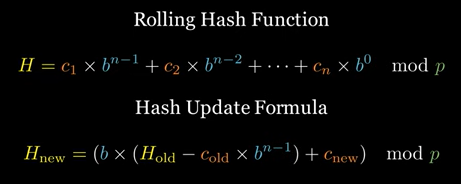

# Strings
---
- A string is a sequence of characters.
- Java provides three different classes for handling strings (String, StringBuilder, StringBuffer)

### String (Immutable)
- Immutable (Any modification creates a new String)
- Stored in the String Pool for reuse (memory optimization). 
- Best for fixed, unchanging text.

| Operation                | Time Complexity    | Space Complexity | Reason                                                                        |
|--------------------------|--------------------|------------------|-------------------------------------------------------------------------------|
| Access (charAt(i))       | O(1)               | O(1)             | Direct index access                                                           |
| Concatenation(+)         | O(n)               | O(n)             | Creates a new string each time                                                |
| Substring(substring(a,b) | O(n)               | O(n)             | Creates a new string                                                          |
| Replace(replace(a,b)     | O(n)               | O(1)             | Scans entire string                                                           | 
| Split(split(regex))      | O(n)               | O(n)             | Creates an array of substrings                                                |
| Length(length())         | O(1)               | O(1)             | Directly stored value                                                         |
| Compare(equals())        | O(n)               | O(1)             | Compares character by character                                               |
| Compare (compareTo())    | O(n)               | O(1)             | Lexicographical comparison                                                    |

Avoid using + for concatenation inside loops (use StringBuilder instead).

### StringBuilder (java.lang.StringBuilder)
- Mutable (Modifications happen in the same object)
- Best for string manipulations
- Not thread safe (Better for single-threaded apps)

| Operation            | Time Complexity | Space Complexity | Reason                                 |
|----------------------|-----------------|------------------|----------------------------------------|
| Append (append(x))   | O(1)*           | O(1)             | Amortized O(1), but O(n) when resizing |
| Insert (insert(i,x)) | O(n)            | O(n)             | Shifts characters                      |
| Delete (delete(i,x)) | O(n)            | O(n)             | Shifts characters                      |
| Reverse (reverse())  | O(n)            | O(n)             | In-place reversal                      | 
| ToString(toString()) | O(n)            | O(n)             | Creates a new String                   |

### StringBuffer (java.lang.StringBuffer)
- Similar to StringBuilder but thread-safe (uses synchronization). 
- Use only when multi-threading is required.

| Operation            | Time Complexity | Space Complexity | Reason                                   |
|----------------------|-----------------|------------------|------------------------------------------|
| Append (append(x))   | O(1)*           | O(1)             | Same as StringBuilder but synchronized   |
| Insert (insert(i,x)) | O(n)            | O(n)             | Slower than StringBuilder due to locking |

To find the index of a character(ch) in the alphabet => ch - 'a'
## Common data structures for looking up strings

### Trie/Prefix Tree
A Trie (Prefix Tree) is a tree-based data structure used to efficiently store and search words or prefixes.  
✔ Use Trie for prefix-based problems, word search, auto-completion, and dictionary-based tasks.  
❌ Avoid Trie for exact string matching, palindromes, sorting, or when space is a concern.

          (root)
         /     \
        c       b
       / \       \
      a   a       a
     /     \       \
    t       p       t   <- (End of words: "cat", "cap", "bat") 
  

| Operation | Time Complexity |
|-----------|-----------------|
| Insert    | O(n)            | 
| Search    | O(n)            |

[Implementation of a Trie](Trie.java)  

### Suffix Tree
- A Suffix Tree is a compressed trie-like data structure used for fast substring search, pattern matching, and longest repeated substrings.
- It stores all suffixes of a string.

[Implementation of SuffixTree](SuffixTree.java)

### Rabin Karp 
Best for multiple pattern searches and fast substring search using rolling hash.  
Eg: text = AABACAADABA, pattern = ABA  
Naive method: Compares the given pattern against all positions in the given text.   
Worst Time Complexity: O(n*m), n: length of text, m: length of pattern  

**How Rabin-Karp Works**
- Compute the hash of the pattern (hash(P)) and the first window of text (hash(T)) of size m.
- Slide over the text and compare hashes: 
  - If hash matches, compare characters. 
  - If hash doesn’t match, move to the next window.
  - To calculate the new hash value, Remove the contribution from the outgoing character and add the contribution of the incoming character 

To reduce hash collisions, take a strong rolling hash formula such that the patterns don't match easily.  

c_i → Character values (e.g., ASCII values).  
b → Base value (commonly 256 for ASCII).  
n → Length of the substring.  
p → Prime modulus (prevents overflow and reduces collisions).  

Time Complexity(Average): O(n+m)  
Time Complexity(Worst): O(n*m)  
Space Complexity: O(1)

[Rabin Karp Implementation](RollingHash.java)

### KMP(Knuth-Morris-Pratt) Algorithm
Efficient substring search algorithm that avoids redundant comparisons using preprocessing(Single pattern search).  

**How KMP Works**
- Precompute the LPS (Longest Prefix Suffix) array:
  - LPS[i] stores the longest proper prefix which is also a suffix. 
  - Helps to determine how much to skip when a mismatch occurs. 
- Search efficiently using LPS:
  - Instead of resetting comparisons, move to a previously matched prefix.

Time Complexity: O(n+m)  
Space Complexity: O(m)  
[KMP Implementation](KMP.java)

### Techniques

#### Counting characters
To count the frequency of characters in a string, use a hash table/map.  
For a counter of a string of lowercase latin characters is O(1) not O(n) as it is a fixed content of 26.

#### String of unique characters
To count the characters in a string of unique characters is to use a 26-bit bitmask to indicate which lower case latin characters are inside the string.

mask = 0  
for c in word:  
  mask |= (1 << (ord(c) - ord('a')))  

To determine if two strings have common characters, perform & on the two bitmasks.    
If two words share at least one character, their bitmasks will have a common 1 bit (maskA & maskB > 0).

#### Anagram
An anagram is a word or phrase formed by rearranging the letters of another word or phrase, using all the original letters exactly once.   
To check if two words are anagrams:
- Result from sorting both strings should be equal.   
Time Complexity: O(nlog n), Space Complexity: O(log n)  
[Sorting-based Approach](AnagramChecker1.java)
- If we map each character to a prime number, and we multiply each mapped number together, anagrams should have the same multiple (prime factor decomposition).   
Time Complexity: O(n), Space Complexity: O(1)
- Frequency counting of characters will help to determine if two strings are anagrams.  
Time Complexity: O(n), Space Complexity: O(1)  
[Frequency-Count Approach](AnagramChecker2.java)

#### Palindrome
Sequence that reads the same forward and backward.  
To check if a string is a palindrome:
- Reverse the string and it should be same
- Use two pointers starting from left and right and shift to the middle while comparing characters

## Problems
1) **Valid Anagram**: [Problem](https://leetcode.com/problems/valid-anagram/description/) | [Answer](ValidAnagram.java)  
   Approach: If the lengths of two strings are different definitely they are not anagrams.  
   Maintain a length 26 array for the alphabet and while traversing through the fist array add one for the index of each character.  
   And then while traversing through the second array reduce one for each character.  
   If all the elements of the alphabet array is zero, the strings are anagrams.
